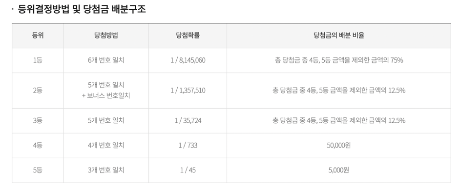

# java-lotto-kakao

[ ] 로또 등수를 판별하는 기능이 있어야 한다.
- 몇개가 일치하는지 판정한다.
- 보너스 볼을 포함하는 지 판정한다.

[ ] 구입 금액에 따른 로또를 구매할 수 있다.
 - 구입금액을 입력받는다. 
 - 1000으로 안나누어떨어지면 Exception(IllegalArgumentException)이 발생한다.
 - 음수 및 0일 경우 위와 동일

[ ] 로또를 생성하는 기능이 있다.
 - 정렬된 형태로 보관한다( 1 ~ 45, 6개 숫자, Unique )

[ ] 당첨번호 입력기능이 있어야 한다.
 - ( 1 ~ 45, 6개 숫자, Unique )에 맞는지 검증한다.
 - 구분자는(",")이다.
 - 보너스볼 입력기능이 있어야한다.( 1 ~ 45, 당첨 볼에 포함되지 않는다. )

[ ] 구입 금액은 int 범위 내로 받고, 출력은 long으로 한다.

[ ] 당첨금을 계산한다.

[ ] 수익률을 계산한다.

 

---

## 기능 요구 사항
로또 구입 금액을 입력하면 구입 금액에 해당하는 로또를 발급해야 한다.
로또 1장의 가격은 1000원이다.
