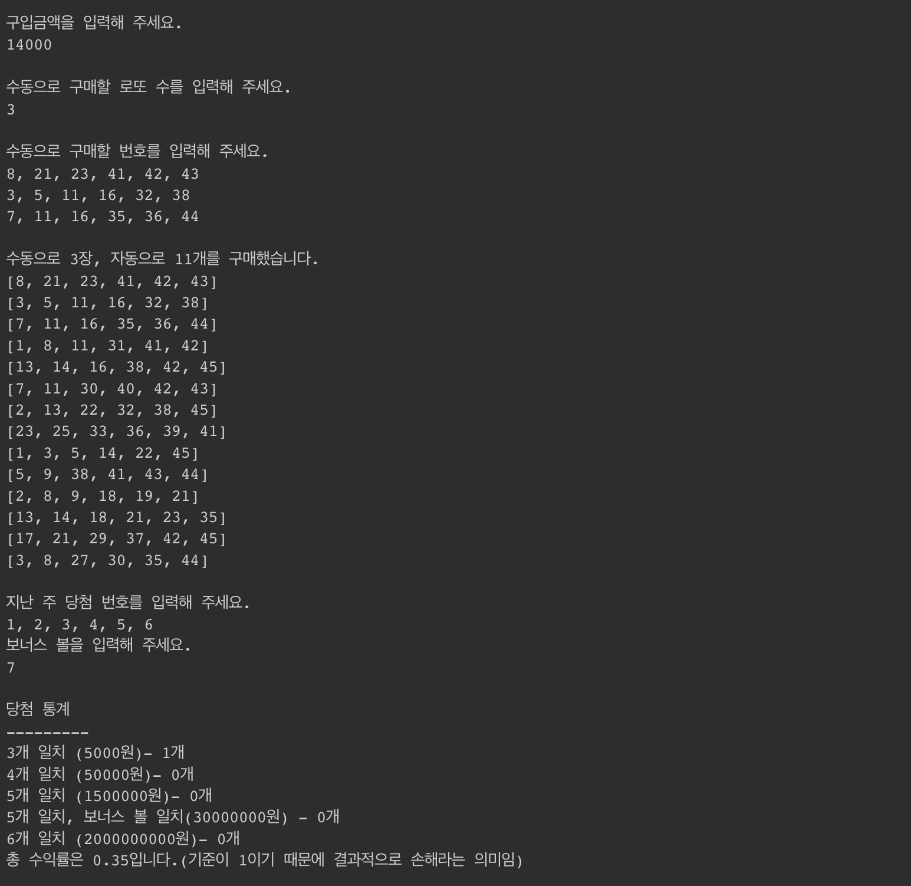

# java-lotto-kakao

### 기능 요구 사항

로또 구입 금액을 입력하면 구입 금액에 해당하는 로또를 발급해야 한다.

로또 1장의 가격은 1000원이다.

총 구매한 로또 개수 = 수동으로 구매한 개수 + 자동으로 구매한 개수

아래와 같이 출력

### 테스트 케이스

[x] 6개의 숫자 중 중복이 없어야 한다.

[x] 모든 숫자가 1 ~ 45 사이여야 한다

[x] 구입 금액에 해당하는 개수만큼 로또를 발급한다.

[x] 구매한 로또의 개수는 수동과 자동의 합과 같다

[x] 입력된 금액이 1000원 미만이면 에러를 발생한다.

[x] 당첨 변호와 몇 개가 일치하는지 확인할 수 있어야 한다.

[x] 보너스 볼과 일치하는 볼이 있는지 확인할 수 있어야 한다.

[x] 당첨 번호가 6개가 아닌 경우 예외를 발생한다.

[x] 당첨 번호가 1 ~ 45 사이의 정수가 아니라면, 예외를 발생한다.

[x] 당첨 번호가 중복된 수가 아니어야 한다.

[x] 보너스 볼이 1 ~ 45 사이의 정수가 아니라면, 예외를 발생한다.

[x] 보너스 볼이 로또 번호에 포함된 경우, 예외가 발생한다.

[x] 당첨 금액에 대한 합을 구할 수 있어야 한다.

[x] 수익률을 계산해야 한다.